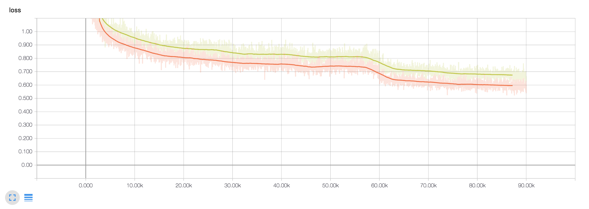
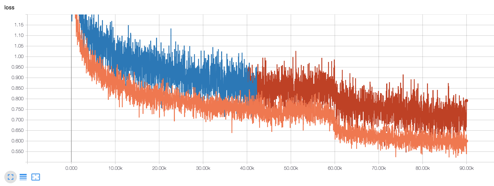
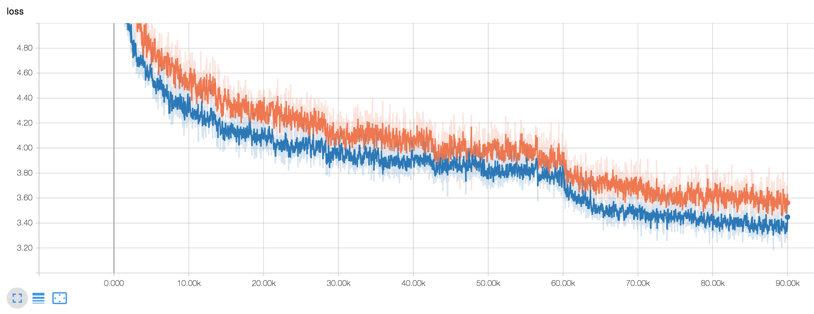

- **Work with returned value of dictionary type**

 ## Benchmark
 Benchmark results with Detectron's checkpoints are same as the numbers reported by Detetron.

 ### faster_rcnn

 - **tutorial_2gpu_e2e_faster_rcnn_R-50-FPN.yaml**

   Mentioned in Detectron's GETTING_STARTED.md:
   > Box AP on coco_2014_minival should be around **22.1%** (+/- 0.1% stdev measured over 3 runs)

   Because lack of multiple GPUs for training with larger batch size, this tutorial example is a good example for measuring the training from scratch performance.

   - Training command:

     `python tools/train_net_step.py --dataset coco2017 --cfg configs/tutorial_2gpu_e2e_faster_rcnn_R-50-FPN.yaml`

   - Exactly same settings as Detectron.
   - Results:

     Box

     | AP50:95  | AP50  | AP75  | APs   | APm   | APl   |
     |:--------:|:-----:|:-----:|:-----:|:-----:|:-----:|
     | 0.221    | 0.412 | 0.215 | 0.094 | 0.238 | 0.317 |

 ### mask_rcnn
 - **e2e_mask_rcnn-R-50-FPN_1x with 4 x M40**

   Trained on commit [3405283](https://github.com/roytseng-tw/Detectron.pytorch/commit/3405283698c8abb29c4f585689588229598d58a0), before changing the Xavier initialization implementation.

   - Training command:

     `python tools/train_net_step.py --dataset coco2017 --cfg configs/e2e_mask_rcnn_R-50-FPN_1x.yaml`

   - Same batch size and learning rate.

   - **Differences** to Detectron:
     - Number of GPUs: 4 vs. 8
     - Number of Images per GPU: 4 vs. 2 (will slightly affect image padding)

   - Results:

     Box

     | AP50:95  | AP50  | AP75  | APs   | APm   | APl   |
     |:--------:|:-----:|:-----:|:-----:|:-----:|:-----:|
     | 0.374    | 0.587 | 0.407 | 0.209 | 0.400 | 0.494 |

     Mask

     | AP50:95  | AP50  | AP75  | APs   | APm   | APl   |
     |:--------:|:-----:|:-----:|:-----:|:-----:|:-----:|
     | 0.337    | 0.553 | 0.358 | 0.149 | 0.360 | 0.506 |

   - Detectron:

     Box

     | AP50:95  | AP50  | AP75  | APs   | APm   | APl   |
     |:--------:|:-----:|:-----:|:-----:|:-----:|:-----:|
     | 0.377    | 0.592 | 0.409 | 0.214 | 0.408 | 0.497 |

     Mask

     | AP50:95  | AP50  | AP75  | APs   | APm   | APl   |
     |:--------:|:-----:|:-----:|:-----:|:-----:|:-----:|
     | 0.339    | 0.558 | 0.358 | 0.149 | 0.363 | 0.509 |

   
   Green: loss of this training.  
   Orange: loss parsed from Detectron's log

 - **e2e_mask_rcnn-R-50-FPN_1x with 2 x 1080ti**
   - Training command:

     `python tools/train_net_step.py --dataset coco2017 --cfg configs/e2e_mask_rcnn_R-50-FPN_1x.yaml --bs 6`

   - Same solver configuration as to Detectron, i.e. same training steps and so on.

   - **Differences** to Detectron:
     - Batch size: 6 vs. 16
     - Learing rate: 3/8 of the Detectron's learning rate on each step.
     - Number of GPUs: 2 vs. 8
     - Number of Images per GPU: 3 vs. 2

   - Results:

     Box

     | AP50:95  | AP50  | AP75  | APs   | APm   | APl   |
     |:--------:|:-----:|:-----:|:-----:|:-----:|:-----:|
     | 0.341    | 0.555 | 0.367 | 0.194 | 0.364 | 0.448 |

     Mask

     | AP50:95  | AP50  | AP75  | APs   | APm   | APl   |
     |:--------:|:-----:|:-----:|:-----:|:-----:|:-----:|
     | 0.311    | 0.521 | 0.325 | 0.139 | 0.332 | 0.463 |

   - Detectron:

     Box

     | AP50:95  | AP50  | AP75  | APs   | APm   | APl   |
     |:--------:|:-----:|:-----:|:-----:|:-----:|:-----:|
     | 0.377    | 0.592 | 0.409 | 0.214 | 0.408 | 0.497 |

     Mask

     | AP50:95  | AP50  | AP75  | APs   | APm   | APl   |
     |:--------:|:-----:|:-----:|:-----:|:-----:|:-----:|
     | 0.339    | 0.558 | 0.358 | 0.149 | 0.363 | 0.509 |

   
   Orange: loss parsed from Detectron's log  
   Blue + Brown: loss of this training.

 ### keypoint_rcnn
 - **e2e_keypoint_rcnn_R-50-FPN_1x**
   - Training command:

     `python tools/train_net_step.py --dataset keypoints_coco201 --cfg configs/e2e_keypoint_rcnn_R-50-FPN_1x.yaml --bs 8`

   - Same solver configuration as to Detectron, i.e. same training steps and so on.

   - **Differences** to Detectron:
     - Batch size: 8 vs. 16
     - Learing rate: 1/2 of the Detectron's learning rate on each step.
     - Number of GPUs: 2 vs. 8
     - Number of Images per GPU: 4 vs. 2

   - Results:

     Box

     | AP50:95  | AP50  | AP75  | APm   | APl   |
     |:--------:|:-----:|:-----:|:-----:|:-----:|
     | 0.520    | 0.815 | 0.566 | 0.352 | 0.597 |

     Keypoint

     | AP50:95  | AP50  | AP75  | APm   | APl   |
     |:--------:|:-----:|:-----:|:-----:|:-----:|
     | 0.623    | 0.853 | 0.673 | 0.570 | 0.710 |

   - Detectron:

     Box

     | AP50:95  | AP50  | AP75  | APm   | APl   |
     |:--------:|:-----:|:-----:|:-----:|:-----:|
     | 0.536    | 0.828 | 0.583 | 0.365 | 0.612 |

     Keypoint

     | AP50:95  | AP50  | AP75  | APm   | APl   |
     |:--------:|:-----:|:-----:|:-----:|:-----:|
     | 0.642    | 0.864 | 0.699 | 0.585 | 0.734 |

     
     Orange: loss of this training.  
     Blue: loss parsed from Detectron's log
 [BENCHMARK.md](BENCHMARK.md)
